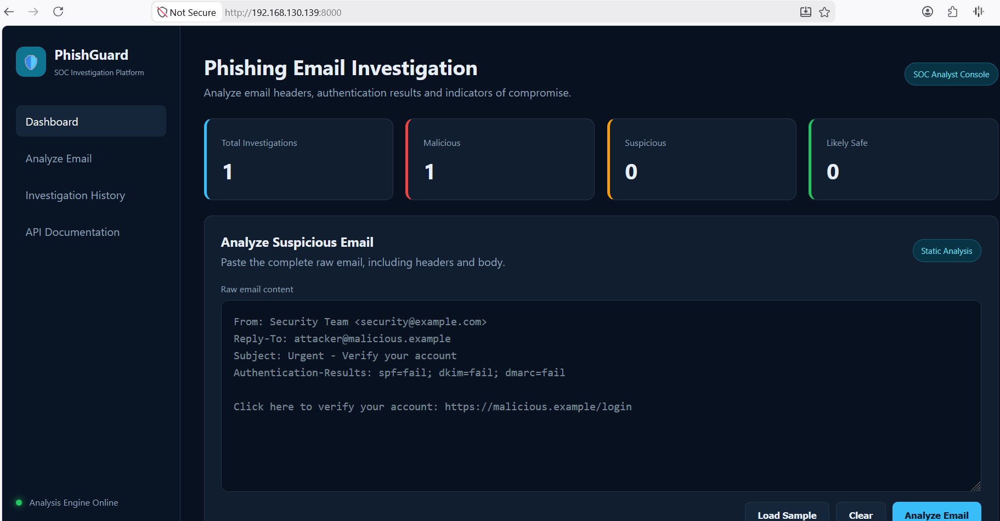
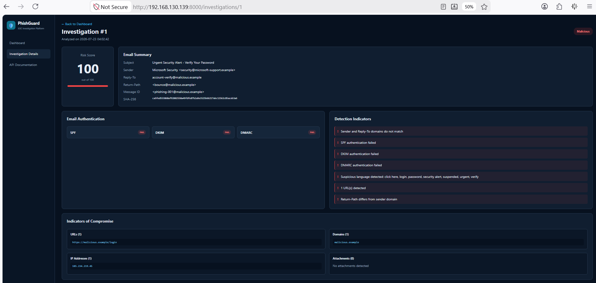
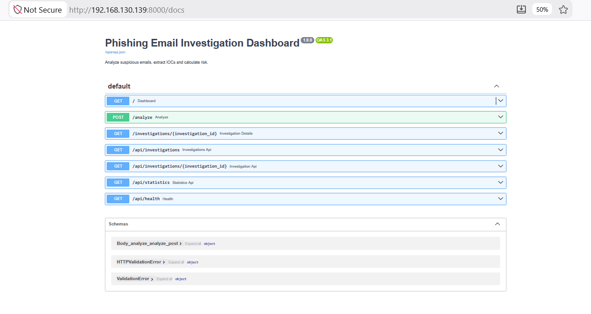

## Run with Docker

```bash
git clone https://github.com/MysticXTharun/phishing-email-investigation-dashboard.git
cd phishing-email-investigation-dashboard
docker compose up --build -d
```

Open the dashboard:

```text
http://localhost:8000
```

## Screenshots

### Dashboard Overview



### Investigation Results



### API Documentation



## Disclaimer

This project performs static analysis for educational and defensive-security purposes. Results should be validated with threat intelligence, sandbox analysis, and analyst review.
